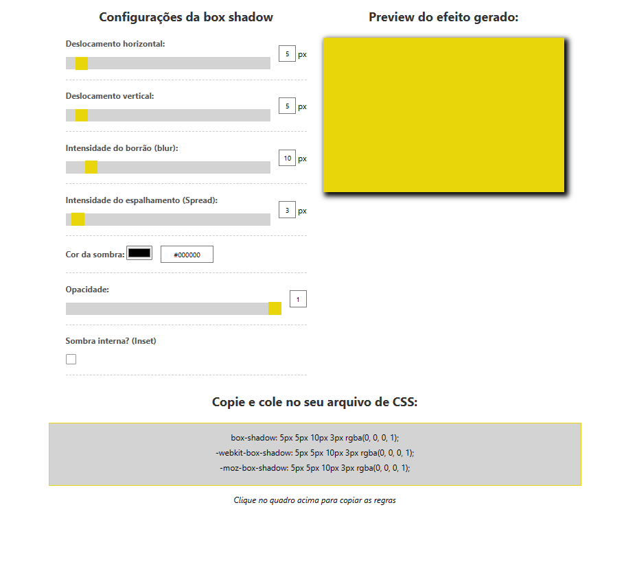

# Box Shadow Generator

Este projeto é um gerador de sombras de caixa (box shadow) que permite aos usuários visualizarem e ajustarem diversos parâmetros para criar e copiar regras de sombra de caixa personalizadas, facilitando o processo para desenvolvedores. 
Projeto realizado em curso de formação frontend, utilizando HTML, CSS e JavaScript.

## Tecnologias Utilizadas

- HTML
- CSS
- JavaScript

## Funcionalidades

- Configurações da Box Shadow:
    Os usuários podem ajustar várias configurações para personalizar a aparência da sombra de caixa, incluindo deslocamento horizontal e vertical, intensidade do borrão, intensidade do espalhamento, cor da sombra, opacidade e a opção de sombra interna (inset).

- Visualização em Tempo Real:
    Conforme os usuários ajustam os controles deslizantes e alteram os valores de entrada, a sombra de caixa é atualizada em tempo real no elemento de visualização, numa manipulação dinâmica através de JavaScript. 

- Copiar Regras CSS:
    Os usuários podem clicar em uma área específica para copiar automaticamente as regras CSS geradas para a sombra de caixa personalizada. As regras são exibidas em formatos padrão, bem como em formatos compatíveis com navegadores específicos, como Webkit e Mozilla. 

- Responsividade:
    O layout da aplicação é responsivo e se adapta a diferentes tamanhos de tela, garantindo uma experiência de usuário consistente em dispositivos móveis e desktops.

## Contribuições

Contribuições são bem-vindas! 

## Autor

- [@RaquelGui](https://www.github.com/RaquelGui)

Sinta-se à vontade para utilizar, modificar e adaptar este conteúdo, de acordo com as necessidades específicas do seu projeto.

## Screenshot do Projeto

